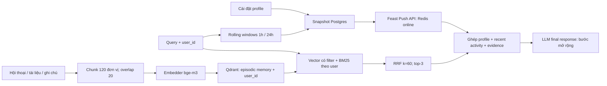

# Hybrid Memory cho trợ lý cá nhân Việt Nam

**Contributors:** học viên chủ repo; Codex hỗ trợ thiết kế/code/tài liệu.
Thiết kế cần học viên review; demo dùng dữ liệu giả lập.

## Luồng dữ liệu

POC trả context, chưa gọi LLM. Collection theo model, project `lab19_bonus`
và bảng `bonus_*` tách khỏi NB1–NB4. Vector query và nguồn BM25 lọc `user_id`.

## Quyết định 1: chunk nhỏ có overlap

Chọn tối đa 120 đơn vị phân cách bằng whitespace, bước nhảy 100, tương đương
overlap 20; đây không phải 120 token của model. Một ghi chú ngắn giữ nguyên;
tài liệu dài chia nhiều đoạn. Metadata giữ `memory_id`, `chunk_index`, user và
timestamp. ID từ user/nội dung chuẩn hóa tránh lưu trùng.

Per-message rẻ, dễ cập nhật nhưng bỏ ngữ cảnh giữa các lượt. Per-conversation
giữ ngữ cảnh tốt hơn nhưng embedding dễ pha nhiều chủ đề, tốn context window.
Semantic break giữ ý nhưng cần model bổ sung.
Window cố định dễ kiểm tra; overlap giảm mất ý, đổi lại khoảng
20% vector dư trên tài liệu dài. Top-3 giới hạn evidence khoảng 360 đơn
vị; overlap có thể lặp ý. Cần gộp đoạn và đo recall khi mở rộng.

## Quyết định 2: profile dạng bảng, memory dạng vector

Chọn bảng vì dễ giải thích, sửa và kiểm tra PIT; embedding latent diễn tả
sở thích phức tạp hơn nhưng khó kiểm soát drift. Entity của mọi feature là
`user_id`; nguồn batch là Postgres, cập nhật online qua PushSource.

| Feature | Source nghiệp vụ → bảng | TTL view |
|---|---|---|
| `preferred_language` | Cài đặt → `bonus_user_profile` | 30 ngày |
| `reading_speed_wpm` | Người dùng tự khai → cùng bảng | 30 ngày |
| `topic_affinity` | Chủ đề tự chọn → cùng bảng | 30 ngày |
| `active_hours_local` | Khung giờ tự chọn → cùng bảng | 30 ngày |
| `profile_updated_at_ts` | Timestamp profile → cùng bảng | 30 ngày |
| `queries_last_hour` | Đếm query cửa sổ 1h → `bonus_recent_activity` | 1 giờ |
| `distinct_topics_24h` | Đếm topic xác định trong 24h → cùng bảng | 1 giờ |
| `recent_topic` | Topic phổ biến trong 1h → cùng bảng | 1 giờ |
| `activity_updated_at_ts` | Timestamp aggregate → cùng bảng | 1 giờ |

`event_timestamp` là thời điểm snapshot để PIT join lấy giá trị tại lúc query,
tránh lấy profile tương lai khi đánh giá lịch sử như NB4. Timestamp integer
là feature phụ để kiểm tra freshness khi serving. TTL của view giới hạn lịch
sử hợp lệ; không mặc định bảo đảm Redis xóa feature cũ. Agent tự kiểm tra tuổi
profile/activity và đánh dấu thiếu hoặc stale. Counts bao gồm query hiện tại;
topic chưa xác định không tăng số topic distinct. Chưa suy luận mệt mỏi.

## Quyết định 3: freshness theo use case

| Use case | Mục tiêu | Tradeoff |
|---|---|---|
| Vừa lưu tài liệu hoặc hỏi liên tiếp | Memory sau upsert; activity mục tiêu dưới 1 giây | Push tăng chi phí ghi, cần retry |
| Tín hiệu tương tác/tốc độ đọc suy ra | Batch mỗi 5 phút | Ít ghi hơn, chấp nhận lag ngắn |
| Sở thích ổn định/tổng hợp dài hạn | Refresh mỗi ngày | Rẻ, dễ audit, phản ứng chậm |

Khi vừa đọc xong, ứng dụng phải phát sự kiện gọi `remember()`; recall sau khi
lệnh trả về có thể tìm tài liệu mới. Việc chỉ mở tài liệu không tự tạo memory.
POC đồng bộ, chưa đo latency. Profile demo push một lần;
activity tính trong process, ghi snapshot và push mỗi recall.
Feast nhận feature đã tính, không tự tính rolling window. Ghi Postgres trước
Redis giữ lịch sử để PIT; lỗi push làm serving chậm cập nhật. Production cần
outbox/retry, không thể coi hai thao tác là transaction nguyên tử.

## Phương án loại bỏ và ngữ cảnh Việt Nam

Loại bỏ việc lưu toàn bộ hội thoại trong feature store: lookup theo entity
không thay thế truy hồi top-K theo nghĩa, và chu kỳ thêm memory khác profile.
Cũng loại bỏ BM25 toàn cục rồi post-filter: memory của user khác có thể chiếm
top-K, làm recall giảm dù sau đó đã bỏ kết quả ngoại lai.

NFC thống nhất dấu Unicode; lexical tokenizer tách ký tự từ, giữ dấu và thuật
ngữ English như Kubernetes/IAM. Whitespace đơn giản nhưng tách từ ghép tiếng
Việt; pyvi/underthesea có thể tốt hơn, đổi lại thêm dependency và cần kiểm tra
code-switching. Dùng bge-m3 từ lab để truy hồi ngữ nghĩa; BM25 giữ tín hiệu
thuật ngữ, RRF `1/(60 + rank)` với rank bắt đầu 1 cân bằng hai danh sách.
Typo/không dấu chưa xử lý; giữ dấu để tránh nhập nhằng. Thời điểm lưu UTC,
khung giờ profile ghi rõ `Asia/Ho_Chi_Minh`.

## What this POC doesn't handle yet

Chưa có xác thực, mã hóa từng user, sửa/xóa memory, quên tự động, đồng bộ
nhiều thiết bị hay event log bền vững. Filter chưa đủ cho authorization. Activity mất khi
restart và snapshot có thể trùng khi retry. BM25 rebuild theo user phù hợp
demo nhỏ, chưa phù hợp hàng triệu memory. Chưa benchmark chất lượng paraphrase
hay latency, chưa đo token budget bằng tokenizer, và chưa có LLM xử lý prompt
injection trong memory. Học viên tự chạy demo/tests theo README để kiểm chứng.
